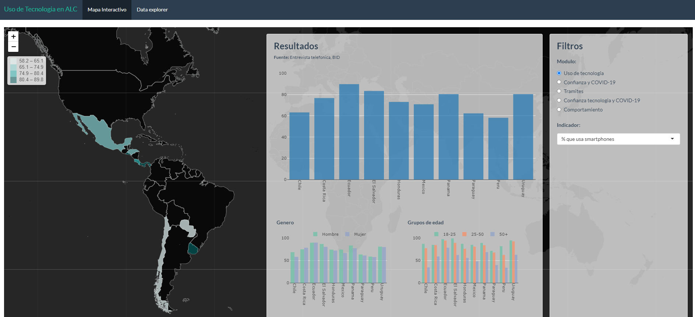

# Dashboard on perceptions of the use of digital tools during COVID-19 from 10 Latin American Countries

## Index: 
- [Description](#description)
- [Structure](#structure)
- [Data source](#data-source)
- [Author(s)](#authors)
- [Citation](#citation)

## Description 
This [dashboard](https://bid-data.shinyapps.io/dashboard_digital_tools_covid19/) presents nationally representative data from a phone survey conducted by the Inter-American Development Bank (IDB) in 10 countries in Latin America: Chile, Costa Rica, Ecuador, El Salvador, Honduras, Mexico, Panama, Paraguay, Peru, and Uruguay. In each country, around 1,000 individuals over 18 years old, randomly chosen from a phone number database, were surveyed. 

The survey included 8 modules on questions regarding the individuals’ perception of the protection and trust of data privacy rights and the use of technology, as well as basic sociodemographic indicators. Modules 1 and 2 include questions about basic individual characteristics (age, gender, and education level) and household characteristics (household size, number of members under 12 and over 60 years old). Module 3 focused on the general use of technology. Module 4 on the trust and protection of data privacy rights in the context of COVID-19. Module 5 includes questions on the impact of the pandemic on daily routines. Module 6 included questions about a hypothetical app from the national government that would not consume data and that would notify users of suspected infection and the next steps. In addition, respondents were randomly assigned to two app regimes: opt-in (download voluntarily) and opt-out (automatically installed). For our analysis, we did not differentiate between these two groups. Finally, Module 7 contained questions about trust and technology in the context of COVID-19 and Module 8 about individual’s perceptions and behavior towards government restrictions and new technologies during the pandemic. 

## Structure
1. raw: includes country-level shapefiles for Latin American and Caribbean countries. 
2. output: includes a list of indicators per module. 
3. preprocessing.do: do file preprocessing raw dataset. 
4. app.R: interactive web app using R Studio. 

## Data source
> SCL Data Lake: [SCL Data/Specialized Survey/Survey on the use of digital tools during COVID-19/data/app/](https://scldata.iadb.org/app/folder/744E8F89-4C5D-48B5-9192-10CB5128CDA1)

## Author(s)
[Laura Goyeneche](https://github.com/lgoyenec), Social Data Consultant, Inter-American Development Bank

## Citation
> “Source: Inter-American Development Bank (year of consultation), Dashboard: Perceptions of the use of digital tools during COVID-19 from 10 Latin American Countries”. We suggest to reference the date on which the databases were consulted, as the information contained in them may change. Likewise, we appreciate a copy of the publications or reports that use the information contained in this database for our records.

## Limitation of responsibilities
The IDB is not responsible, under any circumstance, for damage or compensation, moral or patrimonial; direct or indirect; accessory or special; or by way of consequence, foreseen or unforeseen, that could arise: (i) under any concept of intellectual property, negligence or detriment of another part theory; (ii) following the use of the digital tool, including, but not limited to defects in the Digital Tool, or the loss or inaccuracy of data of any kind. The foregoing includes expenses or damages associated with communication failures and / or malfunctions of computers, linked to the use of the digital tool.
